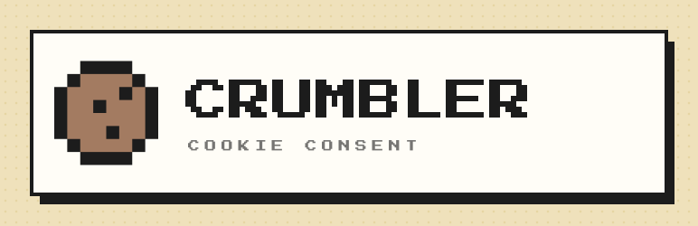
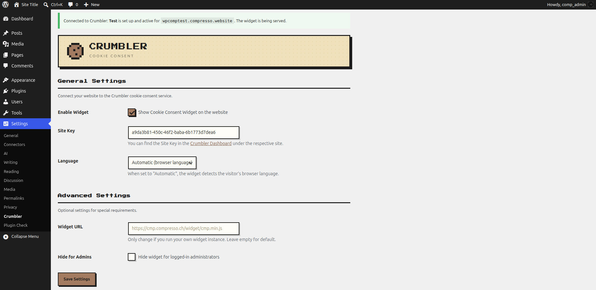
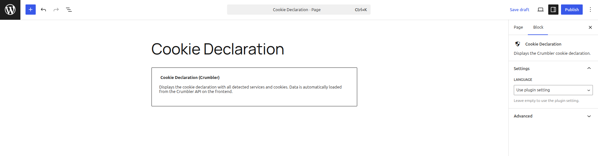
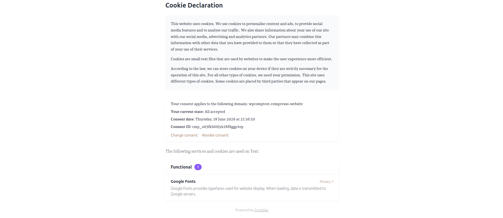

# Crumbler – Cookie Consent



WordPress plugin that connects your website to the **[Crumbler](https://crumbler.ch)** cookie consent service. It loads the consent widget, blocks third-party scripts and iframes before consent, supports Google Consent Mode v2, and renders a cookie declaration via a Gutenberg block or shortcode.

> **Serviceware, not trialware.** Crumbler is a hosted service (SaaS) operated by Compresso AG. A Crumbler account and a site key are required for the widget to work. The **plugin itself is free and fully open source** (GPL-2.0-or-later); the paid functionality lives entirely in the service.

**On WordPress.org:** <https://wordpress.org/plugins/crumbler-cookie-consent/>

## Features

- Cookie consent banner with configurable design (served by the Crumbler widget)
- Automatic script & iframe blocking before consent
- Cookie cleanup for non-accepted categories
- Google Consent Mode v2 support
- Cookie declaration as Gutenberg block (`block.json`) and shortcode `[crumbler_cookies]`
- Multi-language: DE, FR, IT, EN

## Screenshots

**Settings page** — enter your Site Key and see the live connection status.



**“Cookie Declaration” block** in the editor.



**Cookie declaration** on the front end — consent status and detected services.



## Requirements

- WordPress 5.0+ (tested up to 7.0)
- PHP 7.4+
- A Crumbler account → [crumbler.ch](https://crumbler.ch)

## Local development

This repository contains **only the plugin** — it maps 1:1 to `wp-content/plugins/crumbler-cookie-consent`. For local testing it is bind-mounted into a separate [DDEV](https://github.com/ddev/ddev) WordPress install that lives **outside** this repo, so no WordPress core ever lands in the public repository.

```
~/Sites/crumbler-cookie-consent   # this repo (the plugin)
~/Sites/crumbler-wp               # DDEV WordPress (de_CH), plugin mounted in
```

### Setting up the test environment

Install [DDEV](https://github.com/ddev/ddev), then:

```bash
# 1. Create a throwaway WordPress install (NOT a git repo) next to the plugin
mkdir ~/Sites/crumbler-wp && cd ~/Sites/crumbler-wp
ddev config --project-type=wordpress --project-name=crumbler-wp
ddev start
ddev wp core download --locale=de_CH
ddev wp config create --dbname=db --dbuser=db --dbpass=db --dbhost=db
ddev wp core install --url=https://crumbler-wp.ddev.site --title="Crumbler Test" \
  --admin_user=admin --admin_password=admin --admin_email=test@example.com --skip-email
ddev wp language core install de_CH --activate

# 2. Bind-mount the plugin repo into the install
cat > .ddev/docker-compose.plugin.yaml <<'YAML'
services:
  web:
    volumes:
      - "/ABSOLUTE/PATH/TO/crumbler-cookie-consent:/var/www/html/wp-content/plugins/crumbler-cookie-consent"
YAML
ddev restart
ddev wp plugin activate crumbler-cookie-consent
```

The admin lives at `https://crumbler-wp.ddev.site/wp-admin` (admin / admin).

### Coding standards

PHP follows the [WordPress Coding Standards](https://github.com/WordPress/WordPress-Coding-Standards); the ruleset is in `phpcs.xml`:

```bash
phpcs    # check
phpcbf   # auto-fix
```

The plugin passes `phpcs` with **0 errors / 0 warnings** and the official [Plugin Check](https://wordpress.org/plugins/plugin-check/) with no issues. Translations live in `languages/` (de_DE, de_CH, fr_FR, it_IT) as `.po` + compiled `.mo` (PHP) and `.json` (block editor).

### Building a release

`bin/build.sh` produces a clean, distributable ZIP:

```bash
bin/build.sh
# → crumbler-cookie-consent-<version>.zip
```

It exports only committed files (`git archive HEAD`), strips everything listed in `.distignore` (dev / CI / hidden files), and places the plugin inside a top-level `crumbler-cookie-consent/` folder as WordPress requires. The version is read from the `Stable tag` in `readme.txt`, and the build aborts if any hidden file slips into the archive.

### Releasing to WordPress.org

Releases are deployed automatically via `.github/workflows/deploy.yml`:

1. Bump the version in the plugin header (`Version:`) **and** the `Stable tag` in `readme.txt` (they must match), and update the changelog.
2. Commit to `main`.
3. Tag the version and push the tag:

   ```bash
   git tag -a 1.0.1 -m "1.0.1" && git push origin 1.0.1
   ```

Pushing a `X.Y.Z` tag runs [10up/action-wordpress-plugin-deploy](https://github.com/10up/action-wordpress-plugin-deploy), which publishes `trunk`, `tags/<version>` and the `.wordpress-org/` assets to the WordPress.org SVN repository (using the `SVN_USERNAME` / `SVN_PASSWORD` repository secrets).

### Repository layout

```
crumbler-cookie-consent.php   # main plugin file
blocks/                       # cookie-declaration block (block.json + editor.js)
assets/                       # admin.css, cookie-declaration.js, fonts/, logo
languages/                    # .pot + DE/CH/FR/IT translations (.po/.mo/.json)
readme.txt                    # WordPress.org readme
uninstall.php                 # option cleanup on delete
bin/build.sh                  # release builder           (not shipped)
phpcs.xml                     # coding-standards ruleset   (not shipped)
.github/workflows/deploy.yml  # WordPress.org SVN deploy   (not shipped)
.wordpress-org/               # directory icon + banner    (not shipped → SVN assets/)
.distignore                   # paths excluded from the release ZIP
```

## Architecture

- **Serviceware, not trialware.** The plugin is a thin, fully open-source client. All paid logic (subscriptions, the trial, the `is_active` lock) lives in the Crumbler backend, never in the plugin.
- **The widget loads from the service** (`cmp.compresso.ch`) on every page — it is the product, and must stay lean.
- **The cookie declaration renderer** (`assets/cookie-declaration.js`) is **bundled in the plugin for v1.0** (self-contained, easiest to review). The planned **v1.1** moves it to the service as a separate, lazily-loaded script (`cmp.compresso.ch/.../cookie-declaration.js`) so it is available to non-WordPress sites too — while keeping the always-loaded widget small. It stays a separate script (not folded into the widget) precisely so it only loads on the page that embeds it.
- **Two i18n worlds, on purpose:**
  - *Admin/editor strings* (settings page, block editor) use WordPress gettext via `/languages/` — they follow the site locale.
  - *Front-end cookie declaration strings* carry their own translations inside the renderer. The declaration language is per-request (`lang="fr"`) and **independent of the WordPress locale**, and the renderer must also work on non-WordPress platforms where gettext does not exist. In v1.1 these labels are expected to come from the API alongside the provider data.

## Contributing

- Work on feature branches, open a Pull Request against `main`.
- Keep `main` releasable at all times; tagged releases are deployed to the WordPress.org SVN repository.
- Before tagging a release, make sure `phpcs`, the [Plugin Check](https://wordpress.org/plugins/plugin-check/) and `bin/build.sh` all pass cleanly.
- Do not change translatable strings without regenerating the `.pot` and updating the translations.
- Follow the [WordPress Plugin Guidelines](https://developer.wordpress.org/plugins/wordpress-org/detailed-plugin-guidelines/).

## License

[GPL-2.0-or-later](LICENSE) © Compresso AG
